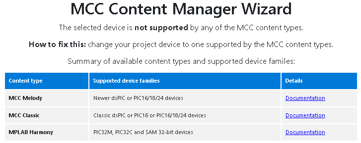
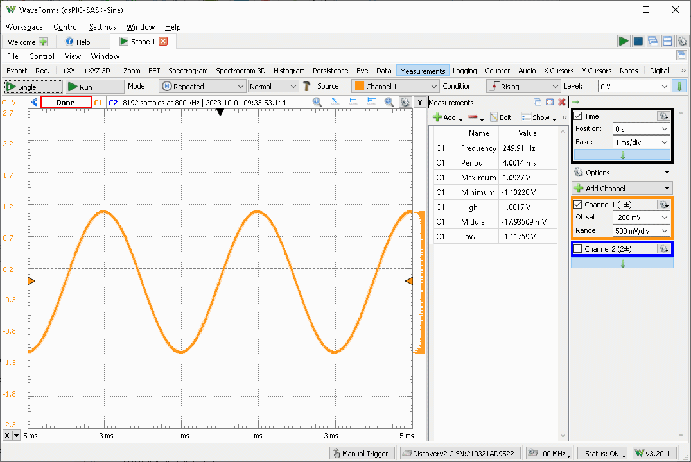
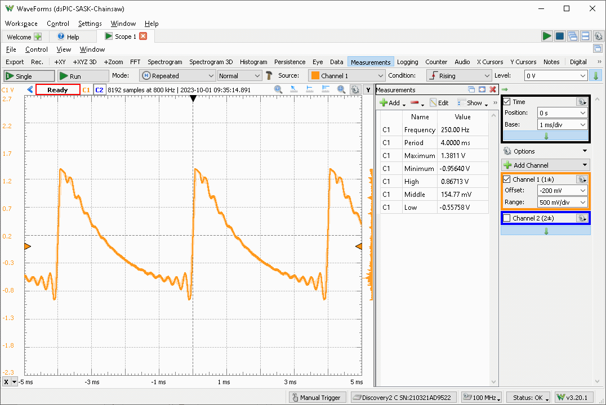

# DM330011 MPLAB Starter Kit for dsPIC Digital Signal Controllers

Here is project page dedicated to board called "DM330011 MPLAB Starter Kit for
dsPIC Digital Signal Controllers".

Top of board:


Bottom of board:


Please note that somehow this board has bad destiny:
* Its Product
  page: https://www.microchip.com/DevelopmentTools/ProductDetails/DM330011
  is GONE! So it may look like this board never existed. However
  you may still find some remains on
  archive.org: https://web.archive.org/web/20190122074625/https://www.microchip.com/DevelopmentTools/ProductDetails/DM330011

* Also you can still buy it (as I did!)
  on: https://www.microchipdirect.com/dev-tools/DM330011?allDevTools=true -
  as of Sep 30 2023, there were 47 items in stock

* Also it is not supported by MCC tool. If you try it on fresh project
  you will get something like:

  

  along with "helpful" advice:

  > How to fix this: change your project device to one supported by
  > the MCC content types.

However if you are like me and still willing to take big unnecessary risk, go
on!

In what sense is this board unique?
You can test and compare two distinct methods of processing audio signal:

1. using Audio CODEC Wolfson WM8510 
2. using regular ADC with anti-alias filter for input and PWM
   with filter for output.

Theoretically you may even mix these two (for example using ADC to sample audio
and Codec to play Audio) if you are willing to write custom firmware for dsPIC.

Please note that WM8510 is Mono (single channel only, primarily designed for
record/speech on mobile phones and VoIP), but I think that it is actually
advantage for experiments.

# Getting necessary files

*Before Buying this board ensure that you can download these files*:

Mirror of Product page:
* https://web.archive.org/web/20190122074625/https://www.microchip.com/DevelopmentTools/ProductDetails/DM330011
* User guide: https://ww1.microchip.com/downloads/en/DeviceDoc/51700B.pdf
* Specific source files:
  * http://ww1.microchip.com/downloads/en/DeviceDoc/SASK%20Flash%20Fill.zip
  * http://ww1.microchip.com/downloads/en/DeviceDoc/SASK%20Flash%20Playback%20Utility.zip
  * http://ww1.microchip.com/downloads/en/DeviceDoc/SASK%20Intro%20Speech%20Prog.zip
  * http://ww1.microchip.com/downloads/en/DeviceDoc/SASK%20Record%20Play%20Demo%20With%20Intro.zip

* The only source file that really uses Audio Codec WM8510:
  * https://web.archive.org/web/20160809232651/http://ww1.microchip.com/downloads/en/DeviceDoc/SASK%20WM8510%20Record%20Play%20Demo%20for%20SST.zip

Additionally you should download WM8510 codec datasheet (hard to get!):
* https://www.tme.eu/Document/40de4947cc4286a2a792635da67be5ff/wm8510.pdf

Problems to mention:
* ~~all sources are for all MPLAB IDE (not X)~~ - solved - see projects below
* ~~all sources are for C30~~ - solved - just replaced dsPIC headers with `xc.h`
* no MCC tool available for this [dsPIC33FJ256GP506][dsPIC33FJ256GP506] - seems
  to affect most dsPIC33FJ (even one on my Microstick II board).
* undocumented signal connectors J2, J3 and J4
* undocumented codec source `SASK WM8510 Record Play Demo for SST.zip`,
  but now I'm able to generate sine and chainsaw waveform -
  project [tone.X/](tone.X/)
* provided source code has more restrictive (but still usable)
  Microchip license, quoting:

```
SOFTWARE LICENSE AGREEMENT:
Microchip Technology Incorporated ("Microchip") retains all ownership and
intellectual property rights in the code accompanying this message and in all
derivatives hereto.  You may use this code, and any derivatives created by
any person or entity by or on your behalf, exclusively with Microchip's
proprietary products.  Your acceptance and/or use of this code constitutes
agreement to the terms and conditions of this notice.
```

That license is actually similar to many (unnamed) ARM Cortex-M vendors... I
can live with that.

# Existing projects

* [swleds.X/](swleds.X/) - trivial switches and LEDs to test
  programmer and board:
  - RED LED blinking using `__delay_ms()`
  - AMBER LED copies S1 state
  - GREEN LED copies S2 state

* [tone.X/](tone.X/)
  - produces Sine or chainsaw tone `/|/|/|` at 250 Hz using codec WM8510.
  - we use 8 000 Hz sample rate (based on original SASK demo),
    so one period of signal has 32 samples for 250 Hz ( 8000/250 = 32 ).
  - audio can be (un)muted with switch S1 - signaled with Amber (Yellow) LED
  - use switch S2 to change pattern ( sine <-> chainsaw, default sine)
  - scope connected to Headphones output:
  - sine has really nice weaveform (however had to limit volume to 0xfd instead
    of 0xff to avoid Limiter clipping).

    

    Workspace file: [tone.X/digilentad2/dsPIC-SASK-Sine.dwf3work](tone.X/digilentad2/dsPIC-SASK-Sine.dwf3work)

  - but chainsaw is problematic - it should be linear but is logarithmic:

    

    Workspace file: [tone.X/digilentad2/dsPIC-SASK-Chainsaw.dwf3work](tone.X/digilentad2/dsPIC-SASK-Chainsaw.dwf3work])

  - it seems that oversampling kicks in too much in case of chainsaw...

# Questions

The on-board programmers behaves in specific way.
It is identified as `SKDE 33 AUDIO S.No : BUR....`

When attempting to read Device-ID only very limited output is given:
```
Initializing...
Initialization succesful...
Firmware Version: 0.0.25
Firmware Version: 0.0.25
Reading Target...
done
```


[dsPIC33FJ256GP506]: https://www.microchip.com/en-us/product/dsPIC33FJ256GP506
